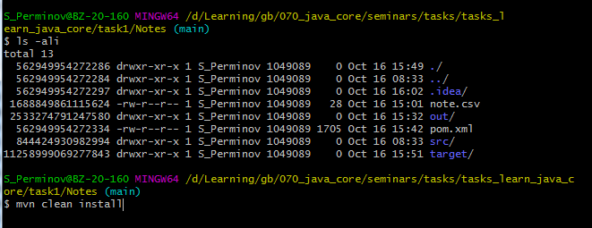
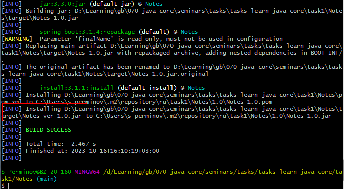
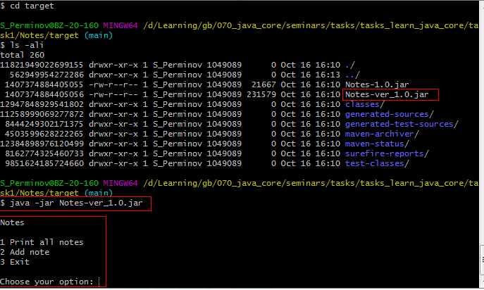

## Задача 1 Компиляция и интерпретация кода
1.  Создать приложение с вложенностью пакетов не менее 3х, где будет класс для входа и несколько классов с логикой. Пример: приложение для внесения заметок во внешний файл с обязательной фиксацией времени

* пример:
Введите заметку: Hello, world!
Дозапись в файл: 16.07.2023 -> Hello, world

### Решение:
Создано приложение Notes - https://github.com/iamseryy/tasks_learn_java_core/tree/task1/task1/Notes

* Скомпилируйте и запустите посредством CLI
### Решение:

* mvn clean install

* java -jar Notes-ver_1.0.jar

